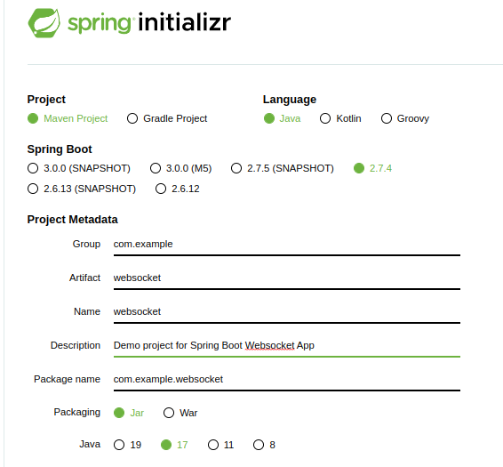
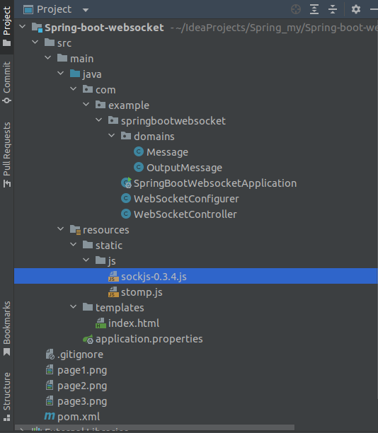
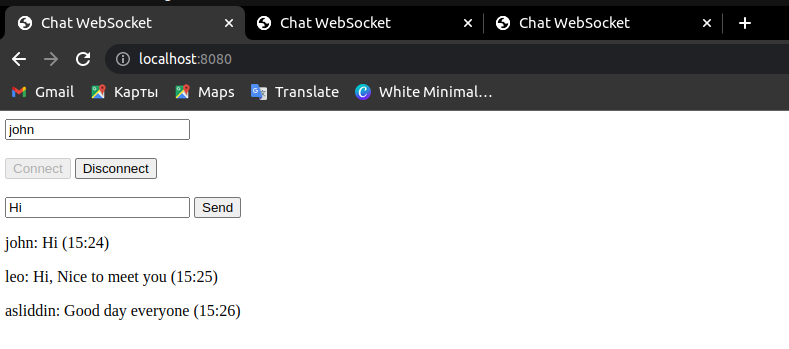
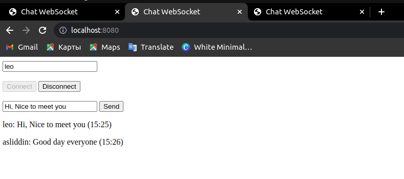
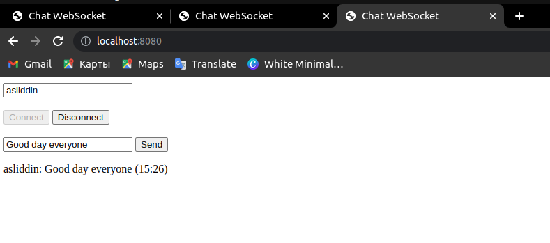

# WebSockets in a Spring Boot Application

## What is Websocket?
>  WebSocket is a computer communications protocol, providing full-duplex communication channels over a single TCP connection.
>  WebSocket is distinct from HTTP. The protocol enables interaction between a web browser (or other client application) and a web server with lower overhead than half-duplex alternatives such as HTTP polling, facilitating real-time data transfer from and to the server.


Once a websocket connection is established between a client and a server, both can exchange information until the connection is closed by any of the parties.

This is the main reasion which websocket is preferred over the HTTP protocol when building a chat-like communication service that operates at high frequencies with low latency.

## What is STOMP?
>  Simple (or Streaming) Text Oriented Message Protocol (STOMP), formerly known as TTMP, is a simple text-based protocol, designed for working with message-oriented middleware (MOM). It provides an interoperable wire format that allows STOMP clients to talk with any message broker supporting the protocol.
Since websocket is just a communication protocol, it doesn’t know how to send a message to a particular user. STOMP is basically a messaging protocol which is useful for these functionalities.

## Setting up the application

* Java version : 17

* Type : Maven Project

* Dependencies : Websocket

* Spring Boot version : 2.7.4



## Project structure



## Configuring WebSocket

Configuring our websocket endpoint and message broker is fairly simple.

```shell
   @Configuration
   @EnableWebSocketMessageBroker
    public class WebSocketConfigurer implements WebSocketMessageBrokerConfigurer {
    @Override
    public void registerStompEndpoints(StompEndpointRegistry registry) {
       registry.addEndpoint("/chat").withSockJS();
    }
    @Override
    public void configureMessageBroker(MessageBrokerRegistry config) {
       config.enableSimpleBroker("/topic/","/queue");
       config.setApplicationDestinationPrefixes("/app");
    }
}
```
 

* @EnableWebSocketMessageBroker annotation is used to enable our WebSocket server.

* WebSocketMessageBrokerConfigurer interface is used to provide implementation for some of its methods to configure the websocket connection.

* registerStompEndpoints method is used to register a websocket endpoint that the clients will use to connect to the server.

* configureMessageBroker method is used to configure our message broker which will be used to route messages from one client to another.

SockJS is also being used to enable fallback options for browsers that don’t support websocket.

## End result




